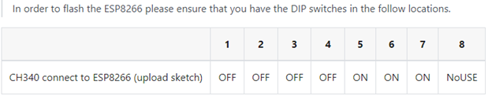
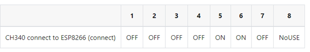
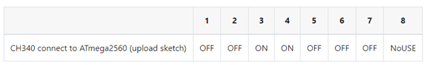
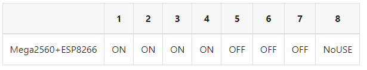

# MEGA with ESP: Mega WiFi 2560 R3  

Project uses a MEGA clone ordered on AliExpress
The project is a class development to make a WiFi AP and have a web server to enable control of hardware.

## Preparing ESP 8266
  
### Dip switch settings:

Flash

AT Test

Program for WiFi

Run

## Flashing

Download and install esptool.py (Python needed)
Download and unZip "ESP8266_NONOS_SDK-3.0.5"

Flash command:
Use a command prompt on Windows

    esptool.py write_flash --flash_mode dio  --flash_size 2MB-c1 0x0 bin/boot_v1.7.bin 0x01000 bin/at/1024+1024/user1.2048.new.5.bin 0x1fb000 bin/blank.bin 0x1fc000 bin/esp_init_data_default_v08.bin 0xfe000 bin/blank.bin 0x1fe000 bin/blank.bin

PS: no need to spescify comport, ESPTool will find it if connected to MEGA

